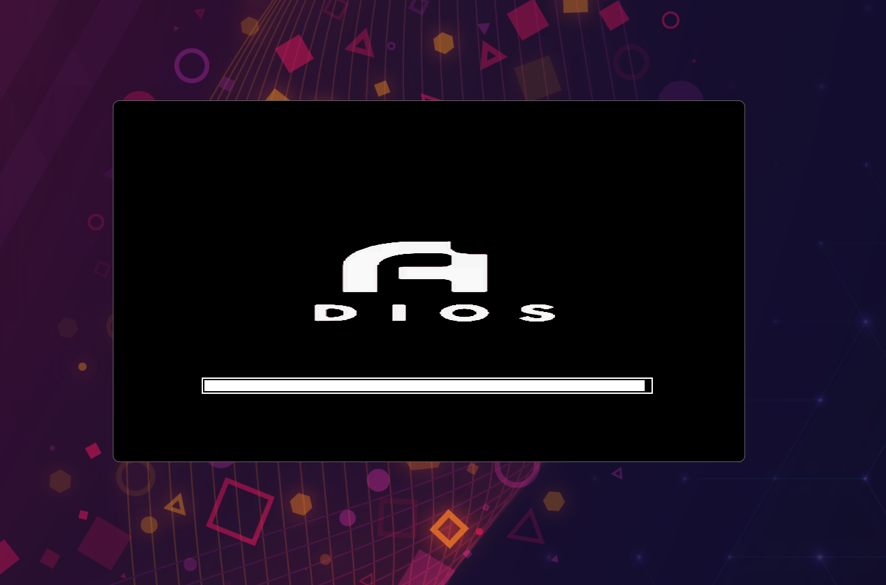
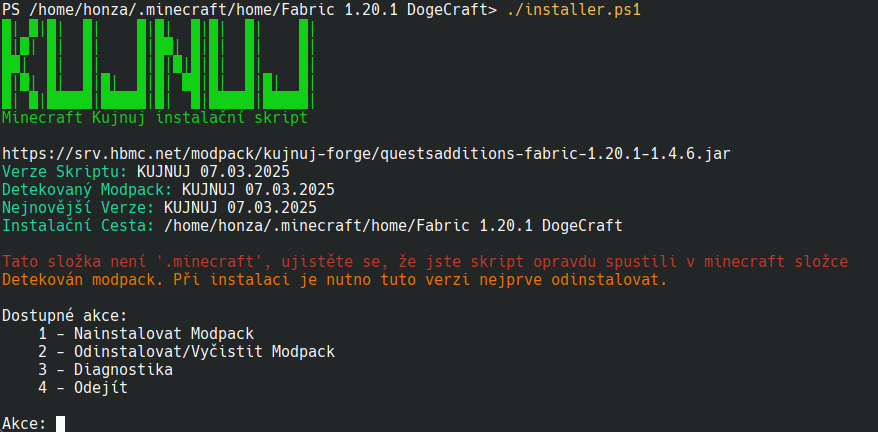
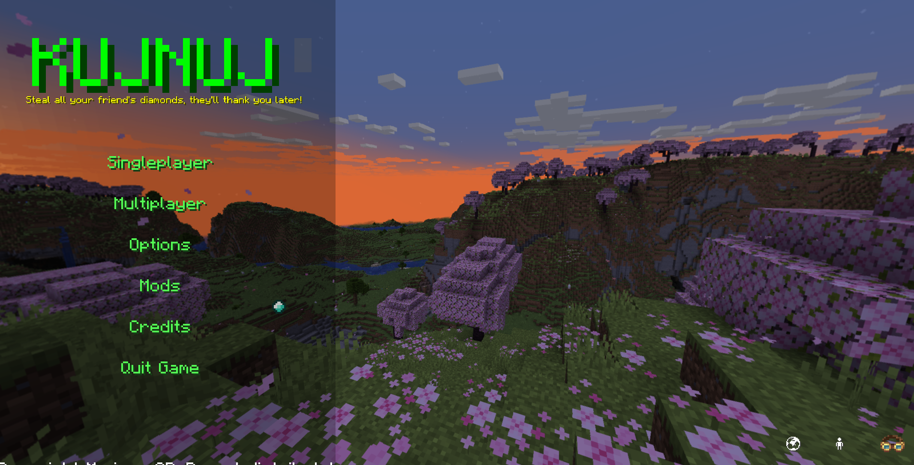
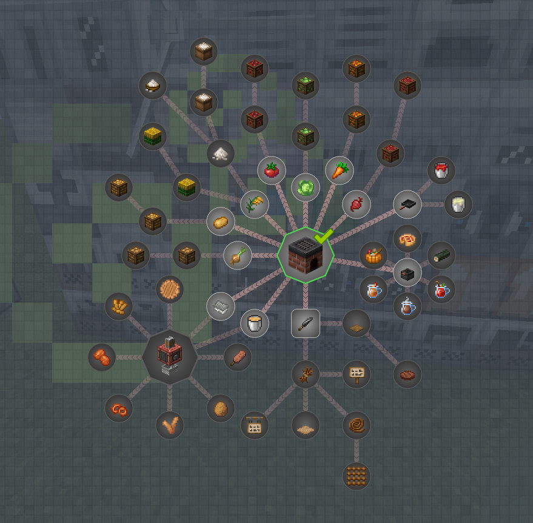
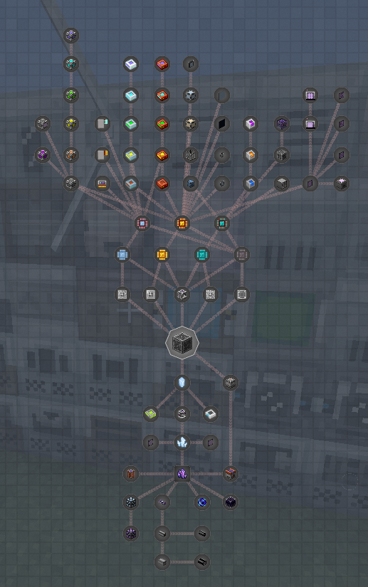

# KUJNUJ MODPACK

## Introduction

Kujnuj (formally known as Dogenuj (formally known as KUJNUJ)) is Minecraft modpack made by Honzapkcz for his semi-private server.
Started by forking Majnr+, it grew up to 400 (this number is being reduced) mods giving optimal performance (honzapkcz here, yes i'm playing on 4k monitor with 14 years old office laptop) and a lot of new content for everyone to never get bored (from looting dungeons to building fusion reactors)!

> **NOTE**: This is currently kitchen sink modpack. It's meant so everyone has fun on my server. I'm doing a lot of rework and integration but I'm alone, so it's going to take a little time.

**Everything tech related goes around these:**

- Create (being the main one)
- Tech Reborn (the tech classic)
- Ad Astra (to the moon!)
- Tom Simple Storage
- Computer Craft Tweaked
- about 30 other Create addons
- ~~Valkirien Skies (Clockwork integration)~~

**For adventurers, magicians and gardeners:**

- Archon (magic)
- Travelers Backpacks
- Farmers Delight
- Amendments
- Supplementaries
- Regions Unexplored
- Naturalist
- YUNGS Dungeons
- Better End
- Better Nether
- Mythic Upgrades

**For builders and tinkerers:**

- Chipped
- Handcrafted
- Immersive Paintings
- Plushies
- Macaw's furnitures (all of them!)
- AlcoCraft
- so many mods I'll rather free up some space

**Other notable roleplay and QoL mods:**

- Emotecraft
- Origins
- Lootr
- Xaero's minimap/worldmap or Journeymap
- Shift/Ctrl/Alt Keybinds
- Iron Chests
- Goblin Traders
- A LOT of Quality of Life mods

## Communicating

Dogenuj is a Czech server, so expect many people talking in Czech.
Don't use a translator, ask us, we know English really well.

## Installing

> **TODO**: finish this section

We use our own installer instead of standard zips. Why? See #Contributing section.

They don't do much, they can install, uninstall or show diagnostics and warnings if something feels off.
(if the folder isn't .minecraft or if there are already mods in mods folder)

Shove one into your minecraft folder (or clone with repository) and run correspondingly.

~~We supply `.ps1` for windows users (use the compiled `.exe` in Releases for painless experience)
And `.sh` for Linux. (just `chmod +x installer.sh` and run it)~~

A new cross-compatible installer with more advanced interface in Python is under deployement.

And hopefully ready to use! We compile them for Linux and Windows and optionally supply raw .py files.

## A ~~little bit of~~ history

### Friend's Idea

I didn't play many modpacks before 9th grade. We always found some cool mods, mashed them together,
and saw what happens. Then Create came out, a complete life changer (not only it changed myself,
but whole modding community) and I just could not play Minecraft without it.

Then best friend (StringedPrune01, sometimes Stay_Fizl) came out to me in 9th grade in 2023 (we went to same middle school) before holidays. He told me he's going to attend at different school. But because we
didn't want to lose contact, he told me we could create our Minecraft server somewhat simmilar to Majnr+ (the 
one of the most well known youtuber SMP here in Czechia), while tweaking some bits.

### KUJNUJ, The Father

The first name was "StringedPrune smells" (*Lukáš smrdí!*) but officially, Striged came with a name "KUJNUJ". To this day,
nobody really know what it means, just a mangle of words that sound good.

I got some mini desktop from my dad's job storage room sentenced *to die*, which in the end was some really
old camera system (that's exactly how I got my current laptop and other e-waste stash). Being good enough,
I quickly restored it to fully working minecraft server and web server with dynmap with one bootable Linux
Ubuntu Server USB stick and some screwing.

### Merging with Dogecraft

This is where Dogecraft comes to play. Dogecraft was another server, whose discord I joined through a lot
of interesting relationships and friends. They were nothing special, a public server with about 20 people trying
to appeal with it's events, giveaways and vanilla+ content. But they had something I didn't, players.

My server didn't have active community, someone always joined, but they came through the "2 week grind" and
left. Dogecraft had problems with Aternos (who wouldn't...) they hosted their server on. Aternos gives you 2.5GB
RAM while the minimal requirements are 4GB! Every time someone joined the server just gave up and crashed.

It took a little longer (because school) to do, but after many months (of procrastination hehe), I officially
annouced Dogenuj+ 2.0.0 in their discord in #annoucements. Everything had to merge, including logo and name.
At that time I also discovered Tech Reborn (really wanted to add GregTech but found only this for Fabric),
Applied Energistics and whole lot of really nice mods.

### The hassle of beight Fat

The 2.0.0 update got really bulky, yeah the previous were too but now we are at 350+ mods. And things start
to get complicated (or rather interesting?). Many mods now get really opiniated how things are made,
thus creating recipe conflicts or worse, they add some really common materials like steel, zinc or tin.

I tried to fight back with CraftTweaker, but CraftTweaker soon became my main enemy. It's own language,
it's quirks and every single line throwing more errors that an entire application burned me down.

Then while browsing help on Reddit I found some comment downwoted ("disliked") into oblivion saying "Just use KubeJS
lmao". Editing recipes and even blocks with javascript became my most favourite thing. (for other developers,
documentation and ease of use does mean a lot!!!)

So yeah, I'm currently tweaking my modpack with KubeJS so it doesn't fall apart once you peek into it.

I hope you enjoyed this ride of dozen paragraphs written at like midnight, documenting this obscure, small,
yet big modpack you just found!

## Contributing

At the time writing this paragraph, I was, I am and I will be for a long time the only one who makes this modpack alone.
So ask me absolutely anything, like everything because I am the only one so far.

Until 3.0.0, this modpack was basicly a kitchensink modpack (pack as much as you can!). I am now fortunately working on
making this a logical modpack with some real progression, trying to connect more mods together.

This progress is for viewing in the huge file TODO.md.

For quick info, we (I to be correct) use KubeJS for recipes, FTBQuests for questbook and our installer in (Power)shell.

### Installer

**Why don't we supply standard zips?**

- Most of the players here have never used their brain or ability to think.
- Nobody (yet) uses launcher that supports modpack installing.
- You don't need to wait 2 hours to download preinstalled zipped modpack. (I have 2 ISPs yet 15MB/s peak)
- Some scumbags don't even know how to properly unpack zips!
- They cannot download anything more than mods (github support is sometimes needed).
- I'm just lazy to look how it works >:).

This is the reason this repository consists of mostly Powershell and shell.

### Recipes & Stuff

Before 3.0.0 we used CraftTweaker, but due to it's esoteric design, constant error splash and terrible writing speed (like 5 lines of code per hour),
we switched to KubeJS.

Files are mostly named after the mod they modify, the game stage (like early_game) or (more rarely) thing they do.

### Questbook

Questbook is done through the game (as one expects).

Instead of awarding random crap, we use Create Numismatics coins. Those coins cannot be earned in any way, so they are really good multiplayer currency.

To have a use for coins in singleplayer, players can buy some items in the special *Money* chapter which they might rather pay for then having to go to find it (like blaze burners)

## Gallery

Our beautiful loading screen (this happenned to someone's computer when they launched version 2.0.0 with 4GB RAM)

Powershell version of the installer (linux version is the same)

Main menu designed with help of fancy menu.

Questlines of Farmer's Delight and AE2 (under rework)

